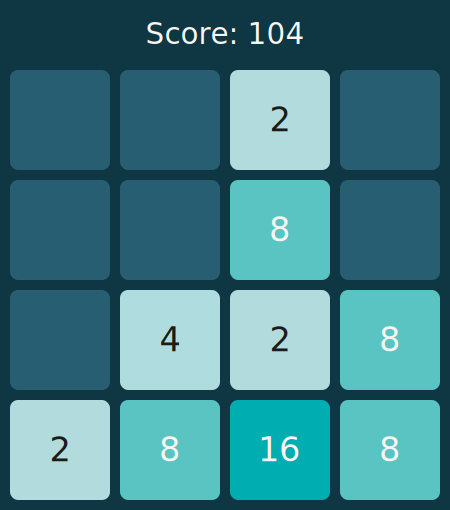

# 👋 Hello, I'm Joel... And this is Github 2048!

Welcome to Github 2048, an open-source game where everyone contributes... a move.   

Combine tiles, rank up your points, and climb the leaderboards!  
**Let's try to reach 2048, together!**

❔ How to Play

1. Make a move by **clicking a button** on the controller.
2. When prompted to create an issue, click `Create`.
3. Refresh this page until the game has processed your move!

❔ Encounter a bug/error?

If you run into any issues, have suggestions, or spot a bug, feel free to open an issue and mention me!

## 🕹️ Current Game Board

<table align="center">
  <tr>
    <td width="50%">
      
    </td>
    <td align="center">
        <h2 align="center">Controls</h2>
        

          
        

        

          
          &nbsp;&nbsp;&nbsp;&nbsp;
          
        

        

          
        

    </td>
  </tr>
</table>

## Statistics

🏆️ Top 5 Scorers

 
<!--START_TOP_SCORERS_TABLE-->
| Rank | Username | Total Score |
|---|---|---|
| 1 | [@FroilanCando](https://github.com/FroilanCando) | 28 |
| 2 | [@joelbaldapan](https://github.com/joelbaldapan) | 24 |
| 3 | [@geloxies](https://github.com/geloxies) | 20 |
| 4 | [@Irvin-S16](https://github.com/Irvin-S16) | 16 |
| 5 | [@james-paul25](https://github.com/james-paul25) | 16 |
<!--END_TOP_SCORERS_TABLE-->

🕙️ Recent Moves

<!--START_RECENT_MOVES_TABLE-->
| Username | Score Earned |
|---|---|
| [@james-paul25](https://github.com/james-paul25) | +16 |
| [@geloxies](https://github.com/geloxies) | +4 |
| [@joelbaldapan](https://github.com/joelbaldapan) | +4 |
| [@FroilanCando](https://github.com/FroilanCando) | +4 |
| [@FroilanCando](https://github.com/FroilanCando) | +0 |
<!--END_RECENT_MOVES_TABLE-->

## 🤖 Want to make your own?
You may check out my [2048 README Engine repository](https://github.com/joelbaldapan/2048-readme-engine/)! 
